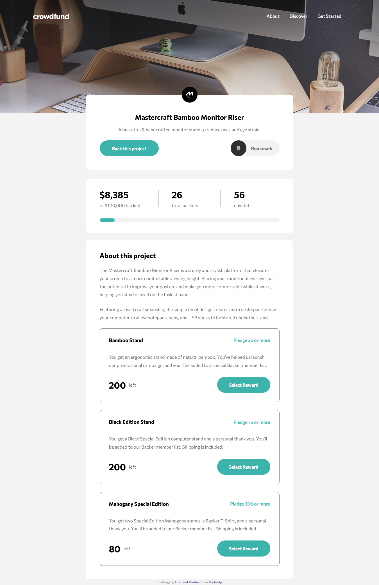
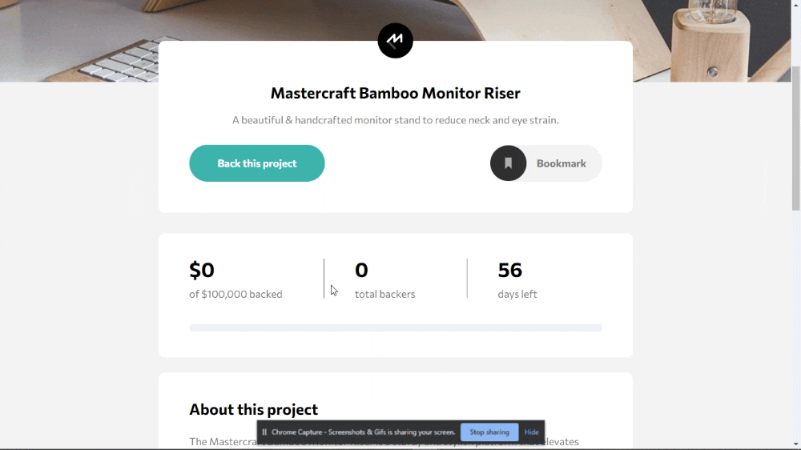

<div id="top"></div>

# Crowdfund: A product crowdfunding page
Crowdfund is a React application used to crowdfund for products. It allows a prospective backer to pledge(s) on products of their choice or donate cash to support the product campaign.

This instance of Crowdfund is crowdfunding for the Mastercraft Bamboo Monitor Riser.

## Overview

The Mastercraft Bamboo Monitor Riser is a sturdy and stylish platform that elevates your screen to a more comfortable viewing height thus reducing neck and eye strain. There are three types of monitor risers; the Bamboo Stand, the Black Edition Stand and the Mahogany Special Edition. Willing backers can pledge on some or all of the available Monitor Risers.

This project is a Frontend Mentor Challenge solution.

### Functionality and Features

Users should be able to:

- [x] View the optimal layout depending on their device's screen size
- [x] See hover states for interactive elements
- [x] Make a selection of which pledge to make
- [x] See an updated progress bar and total money raised based on their pledge total after confirming a pledge
- [x] See the number of total backers increment by one after confirming a pledge
- [x] Toggle whether or not the product is bookmarked


### Screenshot


### Gif

### Links
[Hosted by Netlify](https://crowdfund-app.netlify.app/)
<br>
[Source on Github](https://github.com/b-kip/crowdfundApp)


## My process

### Built with

This application was first built using vanilla JavaScript only. In this first step I used:
  - Semantic HTML5 markup
  - CSS custom properties
  - CSS Flexbox
  - Mobile-first workflow
  - Sass
  - Vanilla JavaScript
  - Parcel Bundler

I later converted it to a React Application.
  - React
  - styled components

### What I learned

  - Using styled components to create components that receive dynamic style values. The Progressbar component determines what percentage of the set pledge target of $100,000 has been received and passes this value as a width of the ::after element of the Bar styled component.
  ```js
    const Bar = styled.div`
      ...
       &::after {
        width: ${props => props.percentProgress};
        ...
        }
      `
  ```
  I chose styles components in favor of [css-vars-hook](https://www.npmjs.com/package/css-vars-hook) that would've allowed me to use CSS custom properties to pass dynamic width values to the ::after pseudo-element.

  - Documenting code with JSDoc.
  - Manually restoring scroll position. Scrolling long modal also changes scroll position of the body. I didn't use `Overscroll-behaviour: contain` because a different scroll behaviour is shown in the design.
  - Responsive font using [fluid sizing](https://css-tricks.com/snippets/css/fluid-typography/)
### Continued development

  - add an email form to allow backers to add personal email. This email will be used to identify backers.
  - store data in a database.
  - Remove side effects from scroll restoration functions.
  - Using hash routing to navigate to the right pledge element and restoring scroll position.
  - Currency localization.

### Useful resource
[Understanding page scrolling when a modal is open](https://css-tricks.com/prevent-page-scrolling-when-a-modal-is-open/)

<!-- GETTING STARTED -->
## Setup Locally

To get a local copy up and running follow these simple example steps.

### Prerequisites

* npm
  ```sh
  npm install npm@latest -g
  ```

### Installation

1. Clone the repo
   ```sh
   git clone https://github.com/your_username_/Project-Name.git
   ```
2. Install NPM packages
   ```sh
   npm install
   ```
4. Start dev server
   ```sh
   npm start
   ```

## Author

[b-kip](https://github.com/b-kip)

<p align="right">(<a href="#top">back to top</a>)</p>